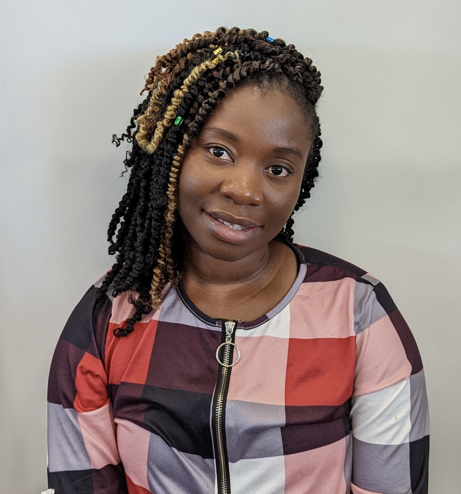

Advanced Programming, Spring 2023

You need to make a fork of this repository[^credits], find your name in the list below, and replace it with something like:

[^credits]: This repository was originally created for [USC's Intro to Health Data Science](https://github.com/USCbiostats/PM566-whoami).

```md
[**@your username**](the URL to your profile) something about you
```

For example, this is what I did with mine:

> [**@gvegayon**](https://github.com/gvegayon) My first programming language was Visual Basic and before going to business school I wanted to be a musician 

Notice the figure of my username (that's optional and fun). This is the code I used of writing that line:

```md
[**@gvegayon**](https://github.com/gvegayon) My first programming language was Visual
Basic and before going to business school I wanted to be a musician

```
Look for your Github username and add a link to your Github profile and something about
yourself (that you don't mind publicly sharing). Remember to only modify the line with your
username!

# PHS7045 Advanced Programming Students (Spring 2023)

h.24901 

[**@Daniel-K-Addo**](https://github.com/Daniel-K-Addo) If you're reading this, it means I finally resolved issues and successfully pulled request. I'm Daniel Addo from Ghana and in the 2nd year of the PHS program. Excited to be learning all this stuff.

[**@Haojia-biostat**](https://github.com/Haojia-biostat) I am orginally from China and came to the US in 2019. I earned my Master's degree in Biostats & DS from Weill Cornell Medicine and joined SDBC in 2020 as a Master Biostatistician. This is the first sememster of my PhD study and I am excited!

KPDuBose [**@KPDuBose**](https://github.com/KPDuBose) I grew up in Logan, Utah, and used to swim competitively. 

[**@LindaAmoafo**](https://github.com/LindaAmoafo) Hi there, I'm Linda Amoafo and, I am excited to be learning all these new stuff. I grew up in Ghana and my background is in statistics. It was great figuring this out! 

blessingofori-atta

Quamena
[**@Quamena**](https://github.com/Quamena) I am Eric, from Ghana. I am always ready to learn new things. I love to watch football games and comedy.

[**@Ravi**](https://github.com/u1374012) I am Ravi (as my username suggest it). Grew up in India, and moved to US in 2018. Interested in Statistics and Badminton, and not sure which one I like more.


# PHS7045 Spring 2023 instructors

[**@gvegayon**](https://github.com/gvegayon) My first programming language was Visual Basic and before going to business school I wanted to be a musician 

[**@chipmanj**](https://github.com/chipmanj) I've lived in many states across the US -- born in Dallas, TX; grew up in Carmel, IN; studied statistics in Provo, UT; earned a masters in Biostatistics in Minneapolis, MN; worked as a masters-level statistician in Boston, MA; earned a doctorate in Biostatistics in Nashville, TN; and now work in Salt Lake City, UT 


[**@gvegayon**](https://ggv.cl) A new line
